# 🛰️ SatQuery AI - Ask Your Satellite Imagery a Question

Remote-sensing analysts spend a lot of time opening scenes, eyeballing land cover, comparing two dates by hand and then writing it all up. I wanted to flip that around: pick an image (or two), ask a question in plain English like *"How much has the built-up area grown here?"*, and get back a direct answer with the numbers, the visual evidence and a confidence score - plus a report you can hand to someone else.

SatQuery handles single optical or SAR scenes, before/after pairs for change detection, and co-registered optical + SAR pairs, all through one guided workflow.

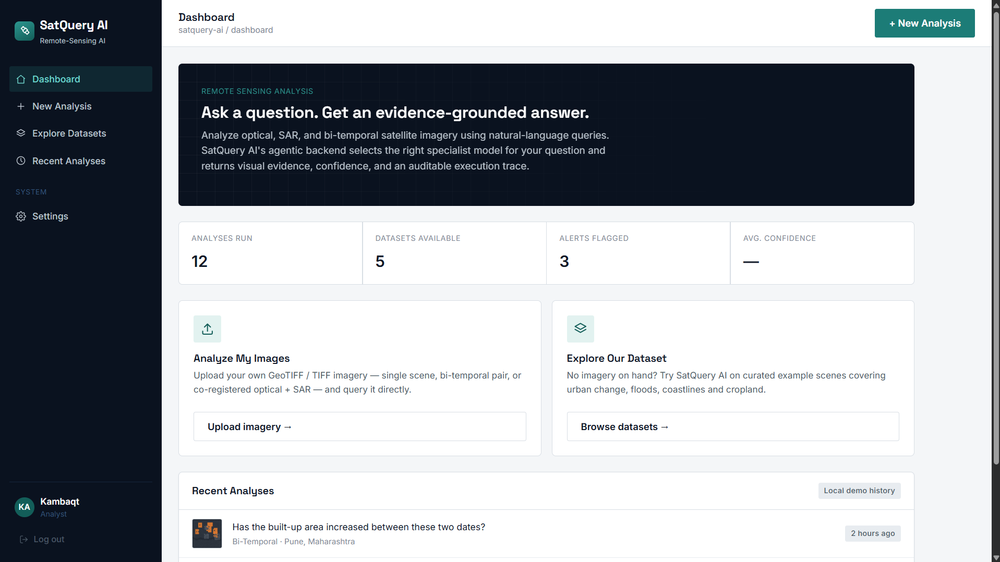

---

## 🎥 Demo

[](https://youtu.be/vNz8omYN77E)

▶️ **[Watch the full demo on YouTube](https://youtu.be/vNz8omYN77E)**

---

## The problem I was trying to solve

- **Satellite tools assume you're a GIS expert.** Getting a simple answer ("is there water here?", "did this area get built over?") means layers, band maths and manual measurement.
- **Answers usually come without evidence.** A number on its own isn't something an analyst can trust or forward.
- **Change detection is a separate workflow** from describing a single scene, and optical and SAR imagery are usually handled in different tools.
- **Nothing is ready to share.** Findings still have to be copied into a report by hand.

SatQuery puts all of this behind one question box: every answer comes with a land-cover breakdown, before/after or classified images, a confidence score, alerts when something significant changed, and an exportable report.

---

## What it does

### Sign-in
Email/password and Google sign-in through Firebase Authentication. User profiles are stored in Cloud Firestore, locked down with security rules so each user can only read and write their own document.

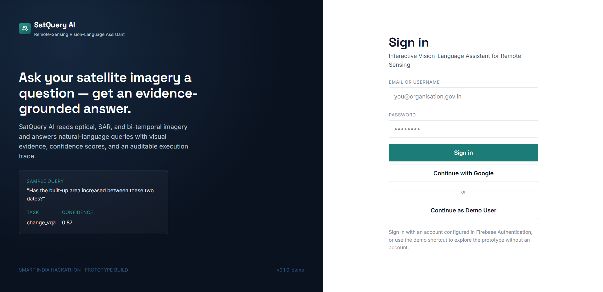

### Dashboard
The landing page shows how many analyses have been run, how many datasets are available, alerts flagged so far and the average confidence, with two entry points: **Analyze My Images** or **Explore Our Dataset**.


### Guided analysis wizard
A step-by-step flow instead of one crowded form:

1. **Data source** - upload your own imagery or pick a bundled dataset
2. **Analysis mode** - single image, bi-temporal (before/after) or optical + SAR
3. **Image type** - optical or SAR (for single-image mode)
4. **Location and date** - pick on a map, search a place, or type coordinates
5. **Question** - ask in plain English, or use a suggested query
6. **Review and run**

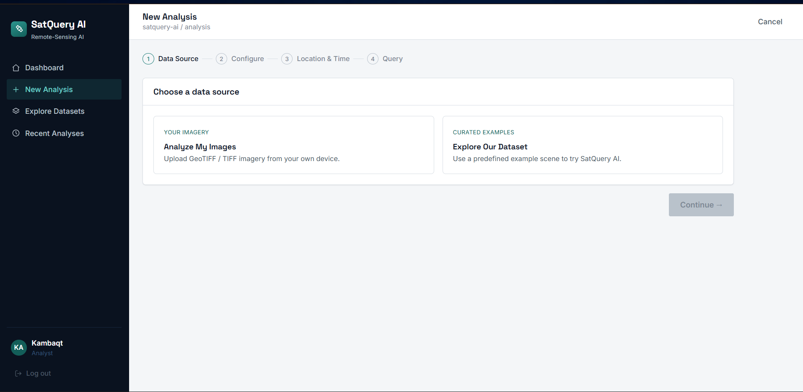
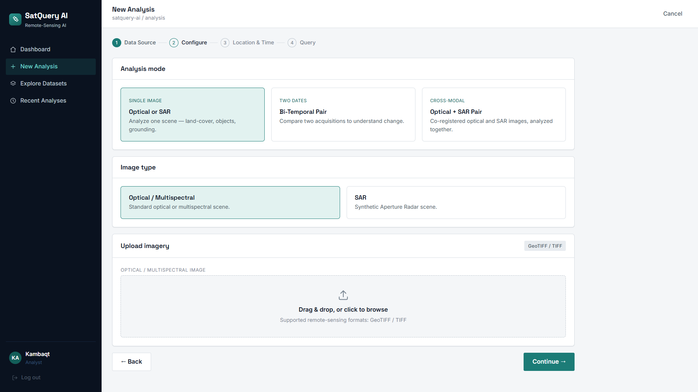
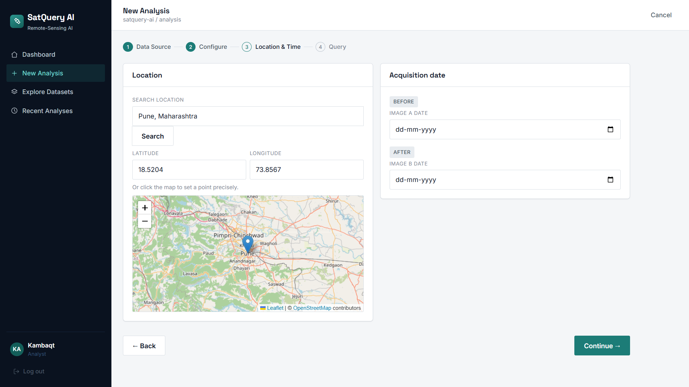
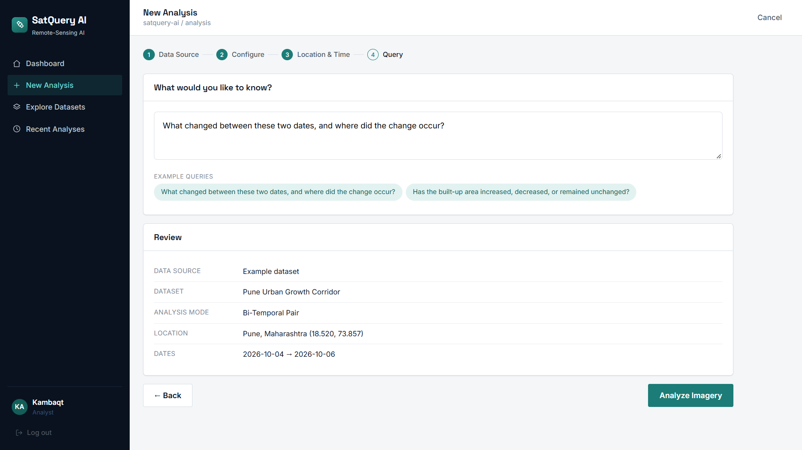

### Live processing view
Once a job starts, the backend reports which stage it's on - input validation, query understanding, task identification, model selection, image processing, evidence generation, result validation and response preparation - and the UI tracks it step by step by polling the job status.

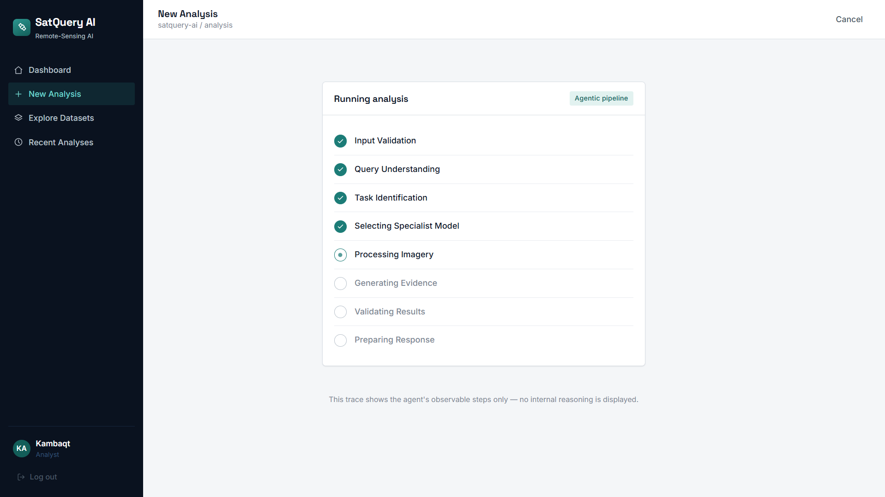

### Single-image analysis (optical or SAR)
Each pixel is classified into **water, vegetation, built-up or bare land**. The answer leads with the dominant cover and lists the rest with percentages. If the question mentions something specific ("show me the water"), that class is highlighted and boxed on the image. Confidence is computed from how clear-cut the scene is, so a mixed scene honestly scores lower than one with a single dominant class.

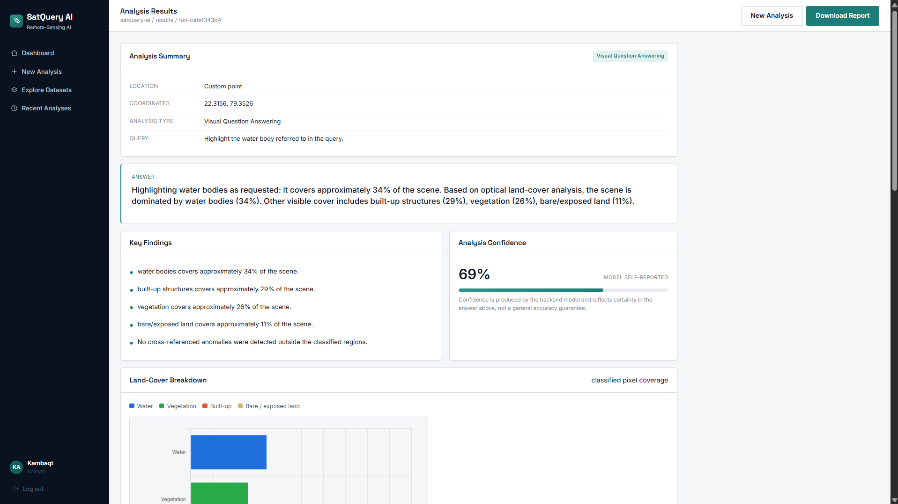
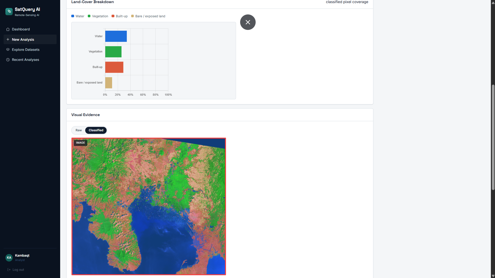

### Change detection (bi-temporal)
Two images of the same place are classified and compared. SatQuery reports how much each land-cover class grew or shrank in percentage points, draws a change map with changed pixels highlighted in red, and raises a **Significant Built-up Change Detected** alert when built-up area moves by more than the configured 3% threshold. If the two images don't match in size, they're resampled to a common grid and a warning is attached to the result.

The evidence panel has three views - a **slider** you drag across the before and after images, **side-by-side**, and the **change map** - and a **Raw / Classified** toggle that switches every view between the original imagery and the colour-coded land-cover classes.

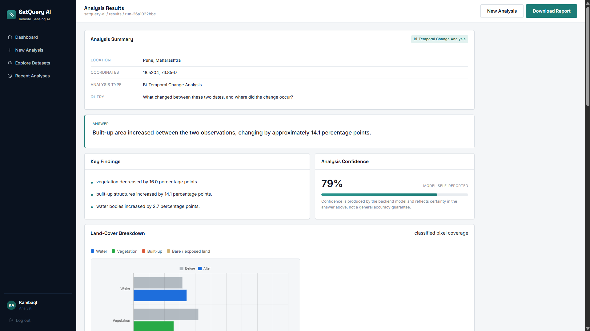
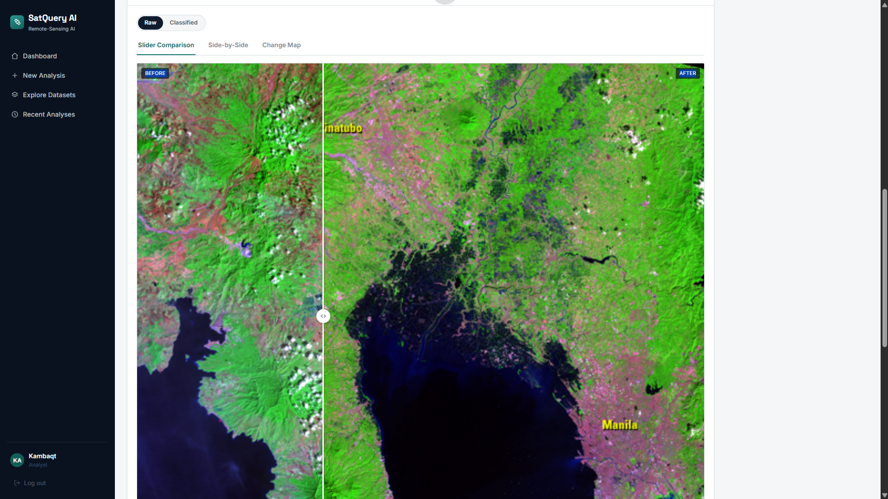
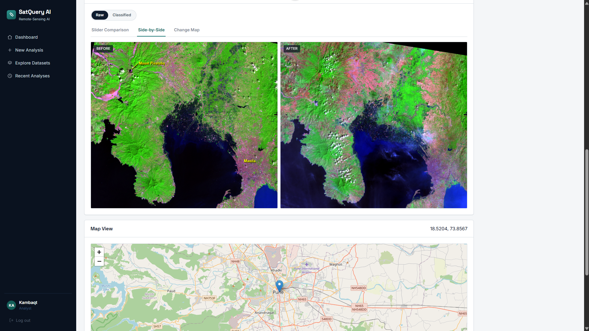
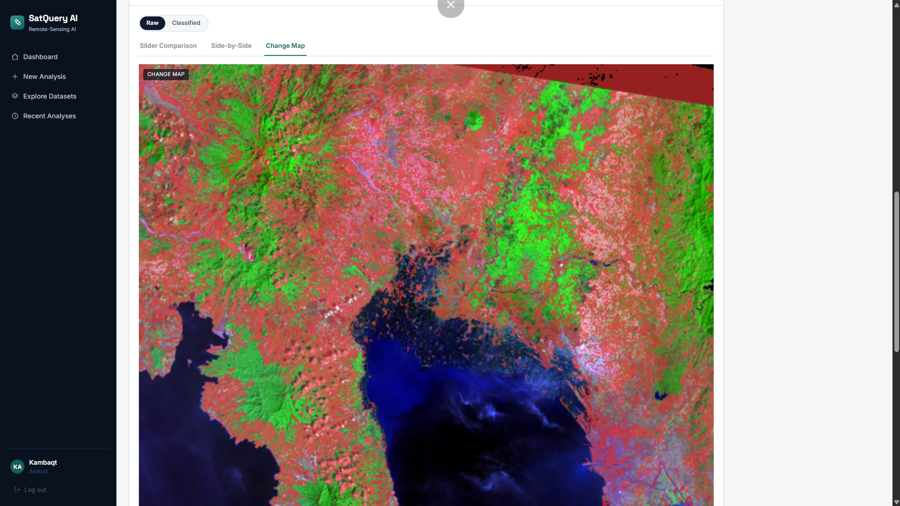

### Optical + SAR analysis
A co-registered optical and SAR pair is classified separately and blended into a fused view. The answer reports how much the two sensors agree on built-up extent, and flags a **Cross-Modal Disagreement** alert when they differ by more than 15 percentage points.


### Results dashboard
Every result has the same layout: the answer, key findings, a confidence score, land-cover bar charts (before/after or optical/SAR where relevant), the visual evidence, a map of the location, alerts, and an execution summary with the task, models, inputs, dates and parameters used.

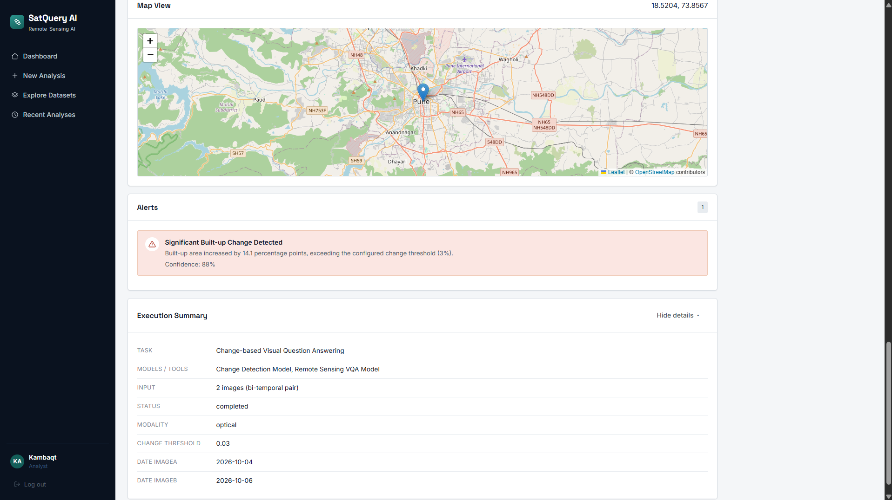

### Reports
**Download Report** builds a clean, printable report from the result - query, answer, findings, alerts, confidence, land-cover bars, evidence images and the execution summary - ready to save as a PDF from the browser's print dialog.

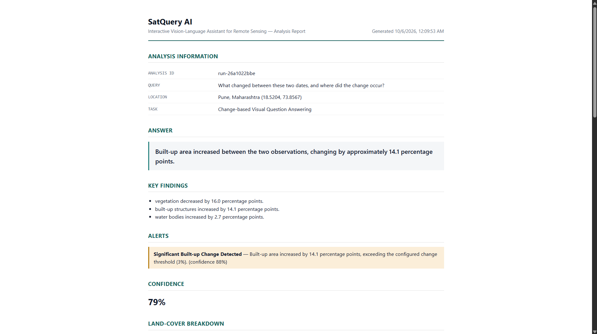
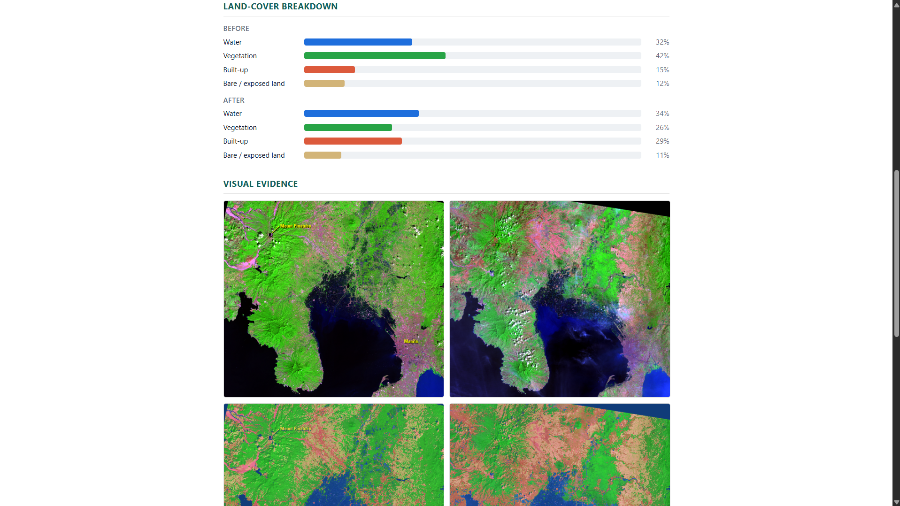

A sample report is in [`docs/sample-report.pdf`](docs/sample-report.pdf).

### Bundled datasets
Five sample datasets so the app can be tried without any imagery of your own:

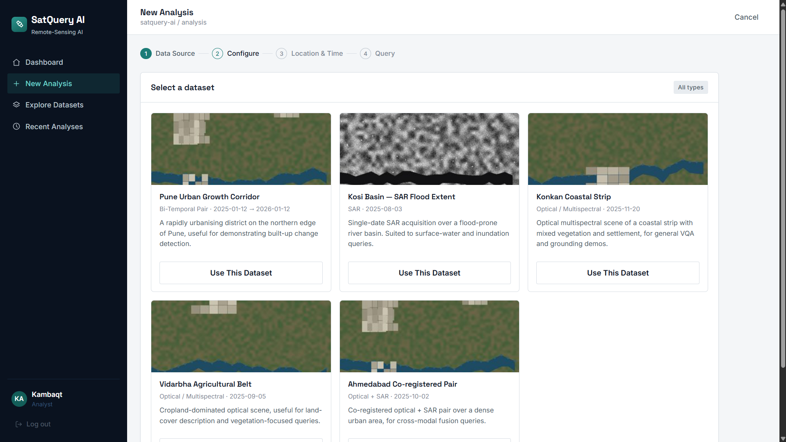


| Dataset | Type | Location |
|---|---|---|
| Pune Urban Growth Corridor | Bi-temporal | Pune, Maharashtra |
| Kosi Basin - SAR Flood Extent | SAR | Kosi River Basin, Bihar |
| Konkan Coastal Strip | Optical | Ratnagiri, Maharashtra |
| Vidarbha Agricultural Belt | Optical | Nagpur District, Maharashtra |
| Ahmedabad Co-registered Pair | Optical + SAR | Ahmedabad, Gujarat |

---

## 🏗️ Architecture

```text
┌──────────────────────────────────────────┐
│        Browser (Vite, vanilla JS)        │
│  Login · Dashboard · Analysis · Results  │
│  Leaflet maps · printable reports        │
└───────┬───────────────────────┬──────────┘
        │                       │
        │ Firebase SDK          │ REST (fetch)
        ▼                       ▼
┌────────────────────┐ ┌────────────────────────────────────┐
│ Firebase           │ │ FastAPI backend                    │
│ Authentication     │ ├────────────────────────────────────┤
│ Cloud Firestore    │ │ /images/upload   store + preview   │
│ (user profiles)    │ │ /datasets        bundled samples   │
│ Hosting (frontend) │ │ /analyze         start a job       │
└────────────────────┘ │ /analysis/{id}   status + result   │
                       │ /stats           dashboard numbers │
                       └─────────────────┬──────────────────┘
                                         │ background task
                                         ▼
                       ┌────────────────────────────────────┐
                       │ Analysis pipeline (8 stages)       │
                       │ validate → parse query → pick task │
                       │ → classify pixels → compare /      │
                       │ fuse → evidence images → answer,   │
                       │ confidence, alerts                 │
                       └────────────────────────────────────┘
```

---

## Tech stack

**Frontend**
- Vite (multi-page, vanilla JavaScript)
- Bootstrap 5 (layout utilities)
- Leaflet (location picker and results map)
- Firebase Web SDK (Authentication + Firestore)

**Backend**
- Python, FastAPI, Uvicorn
- NumPy, Pillow (image loading, classification, evidence images)
- rasterio (optional, for multi-band GeoTIFFs)

**Deployment**
- Frontend on Firebase Hosting
- Backend on Render

---

## Getting it running

### 1. Clone it

```bash
git clone https://github.com/Ryzen-Starbit/SatQueryAISatQuery-AI---Vision-Language-Assistant-for-Satellite-Image-Analysis.git satquery
cd satquery
```

### 2. Backend

```bash
cd backend
python -m venv .venv
```

Activate it:

```bash
# Windows
.venv\Scripts\activate
# Linux / macOS
source .venv/bin/activate
```

Install and start:

```bash
pip install -r requirements.txt
uvicorn main:app --reload --port 8000
```

Check it at `http://localhost:8000/health`. For multi-band GeoTIFF uploads, also run `pip install rasterio`.

### 3. Frontend

In `frontend/js/api.js`, point the app at your backend:

```js
const BASE_URL = "http://localhost:8000";
```

Then, in a new terminal:

```bash
cd frontend
npm install
npm run dev
```

Open `http://localhost:5173/login.html`.

Setting `DEMO_MODE = true` in `js/api.js` runs the whole UI on built-in sample results, with no backend needed.

### 4. Firebase

The web config lives in `frontend/js/firebase.js`. To use your own project:

1. Create a project at [console.firebase.google.com](https://console.firebase.google.com).
2. Enable **Email/Password** and **Google** under **Authentication → Sign-in method**.
3. Create a Firestore database and deploy the rules in `frontend/firestore.rules`.
4. Add a Web app, paste its config into `js/firebase.js`, and add your domain under **Authorized domains**.

### 5. Environment

| Variable | Where | Purpose |
|---|---|---|
| `PUBLIC_BASE_URL` | backend | Public URL of the backend, used to build links to evidence images (default `http://localhost:8000`) |

---

## Deploying

**Backend (Render):** create a Web Service with root directory `backend`, build command `pip install -r requirements.txt`, start command `uvicorn main:app --host 0.0.0.0 --port $PORT`, and set `PUBLIC_BASE_URL` to the service's URL.

**Frontend (Firebase Hosting):** set `BASE_URL` in `js/api.js` to the Render URL, then:

```bash
cd frontend
npm run build
firebase deploy --only hosting
```

---

## How to use it

1. Sign in with Google or email.
2. On the dashboard, click **Explore Our Dataset**.
3. Pick **Pune Urban Growth Corridor** (bi-temporal) and ask *"How has the built-up area changed?"*
4. Watch the processing stages, then read the answer, the land-cover change and the built-up alert.
5. Check the before, after and change-map images under **Visual Evidence**.
6. Click **Download Report** and save it as a PDF.
7. Start a new analysis with **Konkan Coastal Strip** and ask *"Where is the water?"* to see the highlighted class and its bounding box.

---

## 🔗 Project Structure

```text
satquery/
├── backend/
│   ├── main.py               # FastAPI routes
│   ├── pipeline.py           # 8-stage analysis job
│   ├── segmentation.py       # image loading + land-cover classification
│   ├── templates_engine.py   # query parsing, answers, confidence, alerts
│   ├── datasets.py           # bundled sample datasets
│   ├── evidence.py           # evidence images and bounding boxes
│   ├── store.py              # in-memory jobs and uploads
│   ├── config.py             # public URL helper
│   ├── static/datasets/      # sample imagery
│   └── requirements.txt
│
├── docs/
│   └── sample-report.pdf
│
├── frontend/
│   ├── login.html  dashboard.html  analysis.html  results.html
│   ├── css/style.css
│   ├── js/
│   │   ├── api.js            # all backend calls (+ demo mode)
│   │   ├── firebase.js       # Firebase Auth + Firestore
│   │   ├── auth.js           # login page
│   │   ├── app.js            # session, auth guard, toasts
│   │   ├── analysis.js       # analysis wizard
│   │   ├── results.js        # results page
│   │   ├── map.js            # Leaflet helpers
│   │   └── report.js         # printable report
│   ├── assets/images/
│   ├── firebase.json  .firebaserc  firestore.rules
│   ├── vite.config.js
│   └── package.json
│
├── Screenshots/
└── README.md
```

---

## Known limitations / things I'd improve

- **The classifier is deliberately simple.** It assigns each pixel to the nearest of a few reference colours (optical) or a brightness band (SAR). It's fast and easy to reason about, but the next step is swapping in trained models - a remote-sensing VQA model for single scenes, a proper change-detection network and an optical-SAR fusion model. The pipeline is built so those can replace the classifier without touching the rest of the system.
- **Sample data is standard imagery, not geo-referenced GeoTIFFs.** The loader already falls back to rasterio for multi-band GeoTIFFs; what's missing is properly geo-tagged source data for the target regions.
- **Query understanding is keyword-based.** It picks up the land-cover class you ask about, but not more complex questions like counting objects or comparing regions.
- **Jobs and uploads live in memory**, so they're lost when the backend restarts. A database and object storage would fix this.
- **The location search uses a small built-in list of places**, and the dashboard's recent-analyses list is sample data rather than the user's history.
- **Reports use the browser's print dialog** rather than a server-generated PDF.
- **The change map compares class labels pixel by pixel**, so no-data borders (the black edges where a scene doesn't cover the frame) and small misalignments between dates show up as change. Masking no-data areas and co-registering the pair first would clean this up.

---

## Contributing

Contributions and suggestions are welcome.

- Fork the repository
- Create a feature branch
- Commit your changes
- Push to your branch
- Submit a pull request
